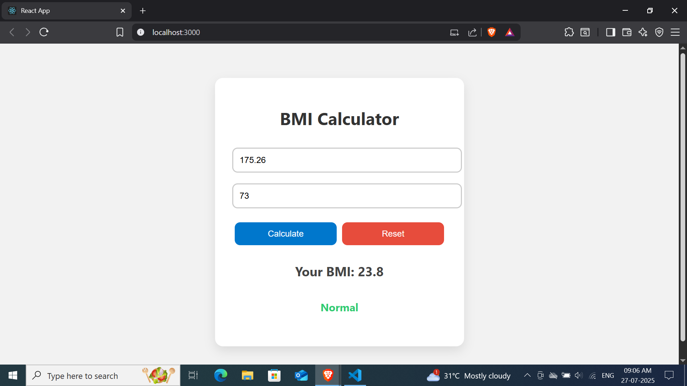

# 🧮 Day 28: BMI Calculator — #100DaysOfReact

This is a responsive **BMI (Body Mass Index) Calculator** built using **React**. Users can input their height (in cm) and weight (in kg), and the app will calculate their BMI and indicate their health status (Underweight, Normal, or Overweight).

## 🚀 Features

- Real-time BMI calculation.
- Health category based on BMI result.
- Responsive design for all screen sizes.
- Clean and modern UI.

## 🧠 What I Learned

- Handling user input with React's `useState`.
- Conditional rendering and logic based on user input.
- Unit conversions and validation handling.
- Styling clean UI layouts with CSS.

## 📸 Screenshot

## 🌐 Live Link

🔗 [Check it Live on Netlify](https://your-bmi-calculator-live-link.netlify.app)

## 🧑‍💻 Tech Stack
- React.js
- HTML5
- CSS3

## 📁 Project Structure

bmi-calculator/
├── public/
│ └── index.html
├── src/
│ ├── App.js
│ ├── index.js
│ └── App.css
└── package.json

## 📌 How to Run Locally
git clone https://github.com/Gauravg2630/React-bmi-calculator.git
cd React-bmi-calculator
npm install
npm start

💬 Connect with Me